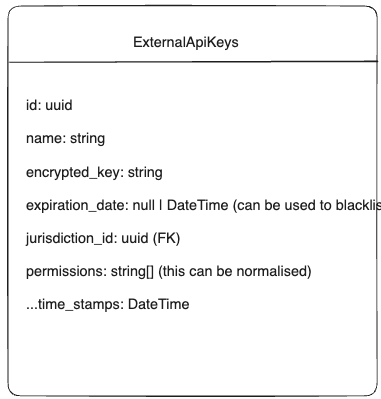
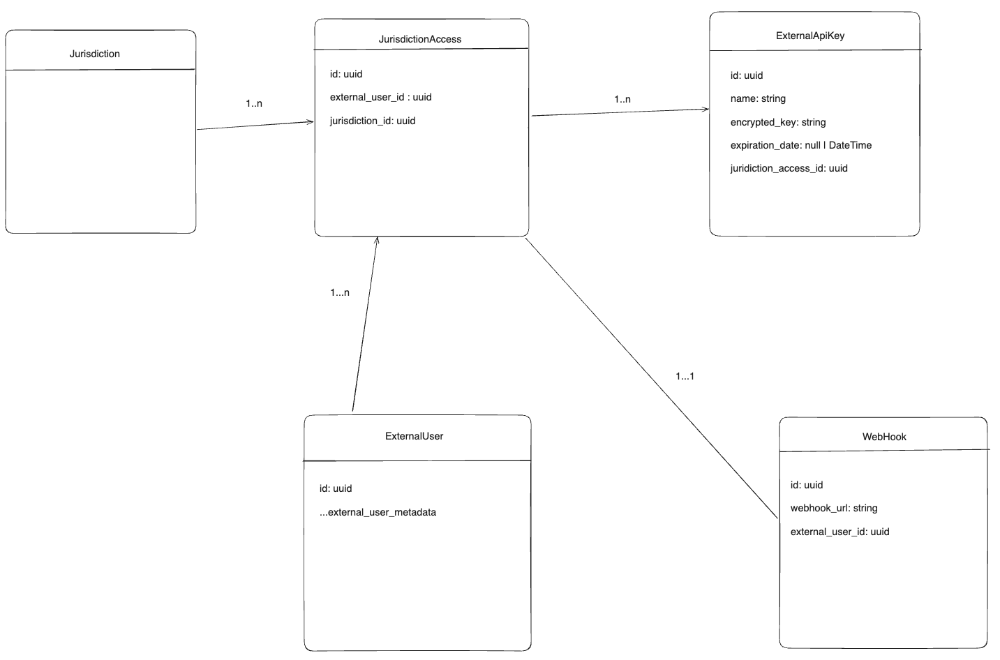

# Integration - V1

## Introduction

This is a rough document which puts forward a proposal of how local jurisdictions might integrate into our system to retrieve
data related to permit applications. Note that this proposal is for a simplified system to only expose **completed
permit applications** and which we can serve within our timeframe for the Beta release on March 2024. This is subject to
change based on requirements changing.

In our initial proposal we are imagining a few use cases that current jurisdictions may have:
1) The jurisdiction is using a digital intake with a separate process for non-digital intake (ab intake clerk or similar role would do data entry).  For the digital intake, users would create an account and upload documents.
2) The jurisidction utilizes a backend permit system, but no digital front-end - typically involving a combination of e-mails / ftp (a intake clerk or similar role would do data entry into the digital backend), with a similar process for non-digital intake (a intake clerk or similar role would do data entry).  Please see the integration path without an API here.


## Integration Path without API
This path may be adopted by jurisdictions that do not have integration capability OR be in a transition phase for jurisdictions that are looking to minimize the change management until they have time to build out integration capabilities.  

In general, upon submission, we would e-mail the jursidiction's intake contact team directly with a link to open / download the application.  They must be logged in / authorized to see the application.

In the case current jurisdictions are sending an ftp link to a contact and then receiving files to kick of the data intake process, this should be a good alternative plug-in solution.

## API Integration

### Authentication

- Authentication can be done by generated API keys/ access tokens which can be added to Auth Header
  - They will be scoped to a jurisdiction
  - Initial version will not have granular permissioning, though we should set this up in the back-end for easier
    extensibility in the future.
  - It should be possible to blacklist generated API keys
  - Initial version of API key won't have an expiration date from user facing side, but the backend should have it

### API key generation suggested flow (under design discussion)

If you have an opinion on what would work for you as a vendor to integrate with us, please let us know.

#### Option 1 (Simpler for V1)

- Third-Party requests API key from BC Gov via external communication
- Super Admin generates API Key and provides them the credentials
- Third-party uses credentials to make requests to our system
- Super Admin should also be able to view generated API keys and expire them as necessary
- Super Admin is also able to add webhook URLs provided by third-party so that they can be notified of permit
  application events.
  - In this simplified approach, the third-party `webhook URL` will belong to the `ExternalApiKey` model and will
    cease to function if the API key is deleted



#### Option 2 (Better but not sure if within scope for the beta release timeline)

- Third-Party creates account/ logs in to an external api portal we create
- Once they are logged in, they are able to search for available local jurisdictions and request access
- Super Admin will see new access request and they can approve/ reject
- If approved
  - Third-Party can generate new API keys for the Jurisdiction
  - They can expire older API keys for the Jurisdiction
  - They will also be able to define their own `webhook_url` or remove them



## Rest APIs

```
base_path: external_api/{version}
include Auth Header with API Key

GET {base_path}/permits

	Optional Query Params:
	- permit_state: "completed" (only one we accept initially and default)
	- page: number
		- default 1
	- records_per_page: number
		- within 1 - 100
		- default 10
	- date_from: Date
	- date_to: Date
	- TBD(we can extend the query params based on requirements)

	OK Response:
		Returns a list of permit application metadata (interface TBD) for the juridiction the API key is scoped to
		- {
			data: {
				permit_applications: Array<PermitApplication>
				current_page: number
				total_pages: number
			}
		- }

```

## Webhook Payload

```

POST to third-party webhook url

interface Payload {
	event: "application_completed"
	payload: {
			data: IPermitApplication (interface TBD)
		}

}
```

- The third-party webhook url should accept a `POST` request
- It should respond with a 200 OK response to acknowledge receipt
  - If a 200 Ok is not received, our service should retry sending the payload N(TBD) number of times

## Generating OpenAPI/Swagger spec from Rails API

- We can use
  the `ruby gem` [rswag](https://github.com/rswag/rswag?tab=readme-ov-file#serve-ui-assets-directly-from-your-web-server) .
  It comes bundled with Swagger UI, which we can serve
  ourselves https://github.com/rswag/rswag?tab=readme-ov-file#serve-ui-assets-directly-from-your-web-server
- Guide to generate OpenAPI/Swagger spec using
  rswag https://www.doctave.com/blog/generate-openapi-swagger-spec-from-ruby-on-rails
