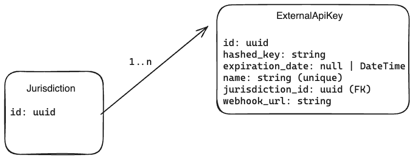

# Integration - V1

## Introduction

This document will outline the V1 design on how third party integrators will integrate into our app.

The V1 API will only expose submitted permit applications and will be scoped at the jurisdiction level. A third-party
integrator will have to obtain a new API key for each jurisdiction they wish to integrate with. The initial
implementation will NOT be self-serve, and the integrators will have to communicate directly with Jurisdictions to
obtain an API key and integrate with them.

## Authentication

- Authentication is done by generated API JWT tokens, which can be added to Bearer Auth Header
  - They will be scoped to a jurisdiction.
  - All API keys generated have a mandatory `expiration_date` field, which is defaulted to 2 years, after which point
    the API key can no longer be used to authorize an API request
  - he API keys can also be revoked immediately, and the revocation date is recorded in the `revoked_at` field. This
    date field is used more as a time stamp as if it’s not `NULL`. Any other value signifies the API key is revoked
    and no longer usable, even if that happens to be in the future

## API key generation flow

- If you have an opinion on what would work for you as a vendor to integrate with us, please let us know
- Super admin/ jurisdiction creates a new API key with a unique name for identification
- Once created, an API token is generated, which the Jurisdiction can share with the third-party integrator
- The jurisdiction can direct the third-party integrator to the `/integrations/api_docs` route of the target
  environment, e.g. in the production environment [Swagger UI](https://buildingpermit.gov.bc.ca/integrations/api_docs),
  to access the
  available integration REST APIs and webhooks
- A review manager can also set up integration mapping between the Building Permit Hub and the third-party integrator
  fields. This is then exposed via the integration API, more details in the API documentation.

## Model

The `ExternalAPIKey` model also has a `revoked_at` field which can be `null | DateTime`

## API documentation

The API documentation can be found [here](https://buildingpermit.gov.bc.ca/integrations/api_docs) or
`/integrations/api_docs` route of the target environment

## Generating OpenAPI/Swagger spec from Rails API

- We can use the ruby gem `rswag` . It comes bundled with Swagger UI, which we can serve
  ourselves [Library](https://github.com/rswag/rswag?tab=readme-ov-file#serve-ui-assets-directly-from-your-web-server)
